# Autonomous SOC Analyst for Microsoft Sentinel

A multi-agent Tier-1 SOC analyst. When Microsoft Sentinel (or Defender XDR through Sentinel)
raises an incident, the agent does the ground work a T1 analyst would do, in seconds:

* **Investigates** in parallel: threat intel on every hash, IP, domain and URL; 72 h of the
  user's sign-ins and audit activity; 24 h of the host's process tree and outbound traffic;
  a fleet-wide hunt for lateral spread.
* **Decides** the flow state: severity (critical / high / medium / low), verdict (true
  positive / false positive / undetermined) with a confidence, alert class, and status
  (investigating, contained, remediated, closed).
* **Contains** within your IR policy: isolates endpoints (Defender for Endpoint), blocks
  IPs / domains / URLs / hashes (Defender indicators and/or your firewall), disables users
  and revokes their sessions (Entra ID and/or on-prem AD).
* **Escalates** by policy: **page** a human now, or put it in the **queue** for the morning.
* **Reports**: a concise, phone-readable IR report is posted to Teams / your pager and as
  a comment on the Sentinel incident, all within a 28-second budget.

The human becomes the strategic overseer: approve what the guardrails held back, roll back
anything with one click, and read the report instead of doing the ground work.

---

## Contents

1. [Architecture](#1-architecture)
2. [Quick start: demo in 5 minutes](#2-quick-start-demo-in-5-minutes)
3. [Demo walkthrough (talk track)](#3-demo-walkthrough-talk-track)
4. [How decisions are made](#4-how-decisions-are-made)
5. [Going live with Microsoft Sentinel](#5-going-live-with-microsoft-sentinel)
6. [Deploying](#6-deploying)
7. [API reference](#7-api-reference)
8. [Security design](#8-security-design)
9. [Extending it](#9-extending-it)
10. [Troubleshooting](#10-troubleshooting)

---

## 1. Architecture

```mermaid
flowchart LR
    S[Sentinel incident] -->|automation rule + Logic App<br/>or polling| O[Triage Orchestrator]
    subgraph Stage1[Stage 1 - parallel investigation]
      TI[Threat Intel Enrichment]
      UA[User Activity]
      EN[Endpoint & Network Traffic]
    end
    subgraph Stage2[Stage 2 - follow the leads]
      TI2[Enrich discovered indicators]
      LS[Lateral Spread Hunt]
    end
    O --> Stage1 --> Stage2 --> A[Assess: score, verdict,<br/>severity, class]
    A --> G[Policy & Guardrail]
    G -->|autonomous| C[Containment: isolate / block / disable]
    G -->|approval / denied| H[Human approval queue]
    C --> E[Escalation: page or queue]
    E --> R[IR Report Agent<br/>template or Claude]
    R --> D[Teams / pager / webhook<br/>+ Sentinel comment & labels]
    R -.->|slow path| M[Malware Analysis sandbox<br/>updates the report]
```



| Agent | What it does | Live data source |
|---|---|---|
| Triage Orchestrator | Owns the incident lifecycle and the 28 s budget | Sentinel REST API |
| Threat Intel Enrichment | Every indicator against every feed, in parallel | Sentinel TI (Defender TI), VirusTotal, AbuseIPDB, OTX, GreyNoise, MalwareBazaar, URLhaus |
| User Activity | Impossible travel, MFA fatigue, password attacks, risky sign-ins, inbox rules, role changes, Entra risk, privileged roles | Log Analytics (SigninLogs, AuditLogs, OfficeActivity), Microsoft Graph |
| Endpoint & Network Traffic | Process behaviors (shadow copy deletion, LSASS dumping, encoded PowerShell...), beaconing; discovers C2 IPs not in the alert | Defender XDR advanced hunting (Graph) |
| Lateral Spread Hunt | Same hash/IP on other devices? Or widely deployed software (benign)? | Defender XDR advanced hunting |
| Policy & Guardrail | Gates every action through `config/ir_policy.yaml` | - |
| Endpoint / Network / Identity Containment | Isolate + AV scan, block indicators, disable user + revoke sessions, and their rollbacks | Defender for Endpoint API, Graph, Azure Automation (AD) |
| IR Report | Deterministic facts + optional Claude narrative | Anthropic API (optional) |
| Malware Analysis (slow path) | Sandbox behavior, blocks newly revealed C2, updates the report | VirusTotal behaviour summaries |

**Demo mode** swaps every live connector for a simulated tenant (`soc_agent/connectors/demo.py`,
`demo_data/`). The investigation, scoring, guardrail, containment and reporting logic is the
same code in both modes.

### Project layout

```
soc-agent/
├── config/ir_policy.yaml        # YOUR IR policy: autonomy, guardrails, escalation (edit this)
├── demo_data/                   # simulated tenant: scenarios, telemetry, threat intel, sandbox
├── deploy/runbooks/             # Azure Automation runbook for on-prem AD disable/enable
├── soc_agent/
│   ├── orchestrator.py          # Triage Orchestrator (flow state, budget, slow path, approvals)
│   ├── agents/                  # investigate.py, analysis.py, response.py, report.py
│   ├── connectors/              # sentinel, defender, hunting, identity, threat_intel, sandbox,
│   │                            # firewall, notify, llm, demo
│   ├── policy.py  scoring.py    # guardrails, escalation, verdict math
│   ├── api.py  web/dashboard.html
│   └── cli.py                   # serve | demo | run | check
└── tests/                       # 59 tests incl. live wiring against a fake Microsoft cloud
```

---

## 2. Quick start: demo in 5 minutes

Requirements: **Python 3.11 or newer**. Nothing else; no Azure account needed for the demo.

**macOS / Linux**

```bash
cd soc-agent
python3 -m venv .venv
source .venv/bin/activate
pip install -r requirements.txt
cp .env.example .env

python -m unittest discover -s tests -t .     # 59 tests, ~10 s
python -m soc_agent demo                      # all 5 scenarios in the terminal
python -m soc_agent serve                     # dashboard -> http://localhost:8080
```

**Windows (PowerShell)**

```powershell
cd soc-agent
py -3.11 -m venv .venv
.\.venv\Scripts\Activate.ps1
pip install -r requirements.txt
Copy-Item .env.example .env

python -m unittest discover -s tests -t .
python -m soc_agent demo
python -m soc_agent serve
```

**Docker**

```bash
cp .env.example .env
docker compose up --build        # -> http://localhost:8080
```

Useful CLI options: `python -m soc_agent demo -s ransomware_workstation --report` prints the
full IR report; `--no-latency` skips the simulated API latency.

**Optional: Claude (or another AI of your choice like Ollama, Gem, or Copilot) writes the reports.** Put an Anthropic API key in `.env`
(`ANTHROPIC_API_KEY=...`). The executive summary, attack narrative and next steps are then
written by Claude; the verdict, evidence tables and actions are still rendered from facts.
Without a key, a template report is used. Both modes support this.

⚠️ Security Note: It is highly recommended to configure your chosen LLM with least-privilege access. This system includes built-in safeguards and a killswitch to ensure the model does not overstep its intended boundaries.

---

## 3. Demo walkthrough (talk track)

Open `http://localhost:8080`. Left: demo alerts. Middle: the **on-call feed** (what reaches
your phone) and the incident queue. Right: the incident.

| Click | What the audience sees | Point to make |
|---|---|---|
| **Ransomware on a finance workstation** | Contained in ~3-4 s: host isolated, payload hash blocked, and a C2 IP that was **not in the alert** discovered from beaconing and blocked. The same hash is found on WKS-FIN-017 and held for approval. Feed shows a **PAGE**. ~6 s later the sandbox report arrives and the report is updated. | Critical always pages, but the human wakes up to a contained incident and one decision to make. |
| Click **Approve** on WKS-FIN-017 | Second host isolated; report and summary update ("Approved by a human"). | Human is the strategic overseer. |
| **Phishing leads to account takeover** | Impossible travel + MFA fatigue + inbox forwarding rule. Account disabled, sessions revoked, URL, domain and IP blocked. Disposition **QUEUE**. | Fully contained high: **nobody is paged at night.** |
| **Credential dumping on a domain controller** | Isolation of DC01 **denied by guardrail**; disabling the tier-0 service account **held for approval**; hash still blocked. **PAGE**. | Guardrails: the agent never isolates a DC or disables tier-0 on its own. |
| **False positive: IT inventory script** | Signed by "Contoso IT", on 212 devices, clean in TI -> **auto-closed**, no action. | Low-fidelity noise disappears. |
| **RDP brute force** | Known scanner blocked, medium, **QUEUE**. | |
| **Roll back** any executed action | Host released / block removed / account re-enabled; audit trail kept. | One-click rollback for everything. |
| Tabs **Agent run** / **Timeline** | Gantt of the parallel agents; every step with timestamps; the KQL used as evidence is at the bottom of the report. | Explainability. |

Tip: fire the ransomware scenario 6 times in a row. The 6th isolation is held for approval by
the **rate-limit guardrail** (max 5 isolations/hour). Use **Reset demo** to start clean.

---

## 4. How decisions are made

Everything below is configured in **`config/ir_policy.yaml`**, your IR policy in machine-readable
form. The file is validated at startup; a typo fails fast instead of changing behavior silently.

**Evidence score (0-100) -> verdict and confidence.** Worst indicator reputation x 0.6,
plus endpoint behavior signals (cap 40), identity signals (cap 30), lateral spread (+15) and the
detection's own severity; exculpatory evidence (trusted internal signer, software present on
many devices) subtracts. Score >= 60 with at least one corroborating signal type is a true
positive; score <= 25 with exculpatory evidence is a false positive; otherwise undetermined.
Confidence grows with the number of independent signal types that agree.

**Severity = impact, not confidence.** Each alert class has a baseline (`severity_by_class`),
escalated to critical for lateral spread or a privileged identity, and bumped one level on a
protected asset. A confirmed brute force that never succeeded is medium; confirmed ransomware
is critical.

**Every action passes the guardrail** (`Policy.gate_action`), in this order:

1. Action disabled or not allowed for this alert class -> not proposed.
2. Not a true positive -> recommended only (false positives -> nothing).
3. Protected host (`dc*`, `*sql-prd*`, ...) -> deny (configurable); tier-0 account or Entra
   admin role -> approval.
4. Global kill switch off -> recommended only.
5. Confidence below `min_confidence_to_contain` -> approval.
6. Autonomy mode for the action: `autonomous | approval | recommend | disabled`.
7. Hosts found by lateral-spread hunting (not named in the alert) -> approval (configurable).
8. Rate limit per action per hour exceeded -> approval.

Internal IP ranges and allowlisted domains/IPs/hashes are never blocked.

**Escalation** rules are evaluated top to bottom; the first match wins:
critical -> page; protected asset or privileged identity involved -> page; confirmed high that
is not fully contained -> page; false/benign positive -> auto-close; everything else -> queue.

**Recommended rollout:** set every action in `autonomy.actions` to `recommend`, run for one to
two weeks and compare the agent's verdicts with your analysts', then switch proven alert classes
to `autonomous`.

---

## 5. Going live with Microsoft Sentinel

Allow about an hour. You need Global Administrator (or Privileged Role Administrator) for
admin consent, and Owner / User Access Administrator on the Sentinel resource group.

### 5.1 Create the app registration

Entra admin center -> **App registrations -> New registration** -> name `soc-agent`, single tenant.
Then **Certificates & secrets -> New client secret** (or use a managed identity when hosting in
Azure; see 6.2). Record the tenant ID, client ID and secret.

### 5.2 Grant API permissions (Application permissions, then Grant admin consent)

| API | Permission | Used for |
|---|---|---|
| Microsoft Graph | `ThreatHunting.Read.All` | Defender XDR advanced hunting (process, network, prevalence) |
| Microsoft Graph | `User.Read.All` | User lookup |
| Microsoft Graph | `Directory.Read.All` | Directory role membership (privileged-identity guardrail) |
| Microsoft Graph | `User.EnableDisableAccount.All` | Disable / re-enable cloud users |
| Microsoft Graph | `User.RevokeSessions.All` | Revoke sessions and refresh tokens |
| Microsoft Graph | `IdentityRiskyUser.Read.All` | Entra ID Protection user risk (needs Entra ID P2; optional) |
| WindowsDefenderATP ("APIs my organization uses") | `Machine.Read.All` | Resolve hostname -> device id |
| WindowsDefenderATP | `Machine.Isolate` | Isolate / release devices |
| WindowsDefenderATP | `Machine.Scan` | Antivirus scans |
| WindowsDefenderATP | `Ti.ReadWrite.All` | Create / delete block indicators |

Microsoft Graph restricts what apps can do to accounts that hold admin roles. The agent's
guardrails already hold those for human approval, which is the intended design.

### 5.3 Assign Azure RBAC roles

On the resource group (or workspace) that contains Microsoft Sentinel, assign the app:

* **Microsoft Sentinel Responder**: read incidents, update status/labels, add comments.
* **Log Analytics Reader**: run KQL against the workspace (sign-ins, audit, threat intel).

### 5.4 Threat-intel feeds (all optional)

Set whichever keys you have in `.env`: `VIRUSTOTAL_API_KEY`, `ABUSEIPDB_API_KEY`, `OTX_API_KEY`,
`GREYNOISE_API_KEY`, `ABUSECH_AUTH_KEY` (MalwareBazaar + URLhaus). `TI_USE_DEFENDER=true` also
checks the Sentinel `ThreatIntelIndicators` table, which includes Microsoft Defender Threat
Intelligence and any TAXII / MISP feed connected to Sentinel. VirusTotal also enables the
malware-analysis slow path.

### 5.5 Configure and check

```bash
cp .env.example .env
# set: SOC_MODE=live, SOC_WEBHOOK_KEY, AZURE_*, SENTINEL_*, TI keys, TEAMS_WEBHOOK_URL ...
python -m soc_agent check
```

`check` validates the config and policy, then probes every API with your credentials (token,
Sentinel, Log Analytics, advanced hunting, Defender, each TI feed, Claude, Ollama, Copilot) and tells you exactly
which permission or setting is missing.

### 5.6 Start safely: recommend-only

In `config/ir_policy.yaml` set every entry under `autonomy.actions` to `recommend` (or set
`autonomy.enabled: false`). The agent then investigates, scores, reports and pages, but only
recommends containment. Process one real incident by hand:

```bash
python -m soc_agent run <sentinel-incident-name-or-ARM-id> --report
```

The incident name is the GUID at the end of the incident's URL in the portal.

### 5.7 Connect Sentinel to the agent (pick one)

**Option A: polling (simplest).** Set `POLL_SENTINEL=true`. The agent checks for incidents in
status *New* every `POLL_INTERVAL_SECONDS` (default 30). Handled incidents are set to *Active*
and labelled `soc-agent`, so they are never processed twice.

**Option B: push via automation rule + Logic App (lowest latency).**

1. Create a Logic App (Consumption) in the Sentinel resource group.
2. Trigger: **Microsoft Sentinel -> "Microsoft Sentinel incident"** (the incident trigger).
3. Action: **HTTP** -> Method `POST`, URI `https://<your-agent>/api/webhook/sentinel`,
   Headers `X-SOC-Key: <SOC_WEBHOOK_KEY>`, `Content-Type: application/json`, Body:
   ```json
   { "incidentArmId": "@{triggerBody()?['object']?['id']}" }
   ```
   (In the designer this is the dynamic-content field **Incident ARM ID**.) Forwarding the whole
   trigger body also works: the endpoint reads `object.id`.
4. Sentinel -> **Settings -> Playbook permissions**: grant Sentinel access to the resource group
   that holds the Logic App.
5. Sentinel -> **Automation -> Create -> Automation rule**: trigger *When incident is created*,
   action *Run playbook* -> your Logic App. Scope it with conditions (e.g. analytics rule names)
   if you want to start with a subset of detections.

Repeated deliveries of the same incident are de-duplicated by the agent.

### 5.8 On-prem Active Directory (optional, for hybrid identities)

Entra ID cannot disable users that are synchronized from AD; the agent disables them in AD
through Azure Automation:

1. Create an Automation account and a **Hybrid Runbook Worker** on a domain-joined server with
   the RSAT ActiveDirectory module.
2. Import `deploy/runbooks/Invoke-SocADUserAction.ps1` as a PowerShell runbook, publish it, and
   run it on the hybrid worker group with an account delegated only "enable/disable user" on
   your user OUs (never Domain Admin). The runbook itself refuses `adminCount=1` accounts.
3. Create a **webhook** for the runbook (run on: Hybrid Worker group) and put its URL in
   `AD_AUTOMATION_WEBHOOK_URL`.
4. Set `IDENTITY_BACKEND=both`: synced users are disabled in AD, cloud-only users in Entra ID,
   sessions are always revoked in Entra ID.

### 5.9 Firewall blocking

`FIREWALL_BACKEND=defender` blocks indicators on every Defender-onboarded device (network
protection must be in block mode for IP/URL/domain indicators). To also block at the perimeter,
set `FIREWALL_BACKEND=both` and point `FIREWALL_WEBHOOK_URL` at your firewall automation
(Logic App, SOAR or script) which receives:

```json
{"action": "block", "type": "ip", "value": "203.0.113.66", "title": "...", "description": "...",
 "expires": "2026-10-03T12:00:00Z"}
```

and later `{"action": "unblock", "type": ..., "value": ..., "ref": ...}` on rollback. Return
`{"ref": "<rule id>"}` if your side needs an id for the unblock. All blocks expire after
`guardrails.block_expiry_hours` (default 72).

### 5.10 Notifications

* **Teams**: in the channel, **Workflows -> "Post to a channel when a webhook request is
  received"**, copy the URL into `TEAMS_WEBHOOK_URL`. The agent posts an Adaptive Card per event
  (PAGE / report / update) with a link to the dashboard when `SOC_PUBLIC_URL` is set.
* **Pager**: `PAGER_WEBHOOK_URL` receives only *page* events (bridge it to PagerDuty/Opsgenie).
* **Everything**: `GENERIC_WEBHOOK_URL` receives every event as JSON (ticketing, SOAR).

### 5.11 Turn on autonomy

When the recommend-only verdicts match your analysts', move alert classes to `autonomous` in
`config/ir_policy.yaml` and restart. Keep the protected-host, tier-0 and rate-limit guardrails.

---

## 6. Deploying

The service is a single container. Keep **one replica**: it holds background work (sandbox
follow-ups, isolation confirmation, the poller) and a SQLite store in `/app/data`.

### 6.1 Docker anywhere

```bash
docker build -t soc-agent:1.0 .
docker run -d --name soc-agent -p 8080:8080 --env-file .env -v soc-data:/app/data soc-agent:1.0
```

Put it behind HTTPS (reverse proxy / Application Gateway) before exposing the webhook.

### 6.2 Azure Container Apps (with managed identity)

```bash
RG=rg-soc-agent; LOC=eastus; ACR=socagentacr$RANDOM; ENV=soc-agent-env
az group create -n $RG -l $LOC
az acr create -n $ACR -g $RG --sku Basic
az acr build -r $ACR -t soc-agent:1.0 .
az containerapp env create -n $ENV -g $RG -l $LOC
az containerapp create -n soc-agent -g $RG --environment $ENV \
  --image $ACR.azurecr.io/soc-agent:1.0 --registry-server $ACR.azurecr.io --registry-identity system \
  --system-assigned --ingress external --target-port 8080 --min-replicas 1 --max-replicas 1 \
  --secrets webhook-key=<SOC_WEBHOOK_KEY> vt-key=<VIRUSTOTAL_API_KEY> \
  --env-vars SOC_MODE=live USE_MANAGED_IDENTITY=true AZURE_TENANT_ID=<tenant> \
    SENTINEL_SUBSCRIPTION_ID=<sub> SENTINEL_RESOURCE_GROUP=<rg> SENTINEL_WORKSPACE_NAME=<ws> \
    SENTINEL_WORKSPACE_ID=<workspace-guid> POLL_SENTINEL=true \
    SOC_WEBHOOK_KEY=secretref:webhook-key VIRUSTOTAL_API_KEY=secretref:vt-key
```

With `USE_MANAGED_IDENTITY=true` no client secret is stored: grant the container app's
system-assigned identity the same Graph / WindowsDefenderATP application permissions (via
PowerShell or Graph, since managed identities have no consent UI) and RBAC roles as in 5.2-5.3.
For a user-assigned identity also set `AZURE_CLIENT_ID` to its client ID. SQLite lives on the
container's local disk; Sentinel remains the system of record (every report is also a Sentinel
comment). Mount an Azure Files volume at `/app/data` if you want dashboard history to survive
restarts.

---

## 7. API reference

Write endpoints require `X-SOC-Key: <SOC_WEBHOOK_KEY>` (or `Authorization: Bearer <key>`, or
`?key=`) when a key is set. Reads are public unless `SOC_DASHBOARD_PUBLIC=false`.

| Method | Path | Purpose |
|---|---|---|
| GET | `/` | Dashboard |
| GET | `/healthz` | Liveness |
| GET | `/api/info` | Mode, connectors, demo scenarios |
| GET | `/api/incidents` | Incident list |
| GET | `/api/incidents/{id}` | Full incident incl. safe report HTML |
| POST | `/api/incidents/{id}/actions/{action_id}/approve` \| `reject` \| `rollback` | Human decisions (approve on a denied action = explicit override) |
| POST | `/api/incidents/{id}/status` | `{"status": "remediated\|closed\|investigating", "verdict"?: "...", "note"?: "..."}` |
| POST | `/api/webhook/sentinel` | `{"incidentArmId": "..."}` or the raw Sentinel trigger body |
| GET | `/api/environment` | Demo environment state + on-call feed |
| GET | `/api/audit` | Action audit log (`?incident_id=`) |
| POST | `/api/demo/run/{scenario}`, `/api/demo/reset` | Demo mode only |

Pass `X-SOC-User: <name>` (the dashboard's name field) so approvals are attributed in the audit log.

---

## 8. Security design

* **The LLM never decides.** Verdicts, severity and every containment decision are deterministic
  and tested. Claude only writes prose, receives the facts as data explicitly marked untrusted,
  has no tools, and the actions table is always rendered from the incident record, so a prompt
  injection in a command line or email subject cannot trigger or misreport an action.
⚠️ Security Note: It is highly recommended to configure your chosen LLM with least-privilege access. This system includes built-in safeguards and a killswitch to ensure the model does not overstep its intended boundaries.
* **Guardrails before autonomy**: protected hosts, tier-0 accounts, admin roles, confidence
  threshold, per-hour rate limits, a global kill switch, internal-network and allowlist
  protection, automatic block expiry, one-click rollback, full audit log.
* **Output escaping**: reports contain attacker-controlled strings. Raw HTML is escaped and
  markdown links/images are disabled before rendering to the dashboard or Sentinel comments;
  the dashboard sets a strict Content-Security-Policy and builds all other UI with `textContent`.
* **KQL injection**: hostnames, UPNs and hashes are validated and quoted before being placed in
  queries; OData filters are escaped; the AD runbook validates its inputs and refuses protected
  accounts itself.
* **Least privilege**: the permissions in 5.2 are the minimum for the actions performed. The
  webhook key is compared in constant time; live mode refuses to start without one.

---

## 9. Extending it

* **New threat-intel feed**: subclass `ThreatIntelProvider` in
  `soc_agent/connectors/threat_intel.py` (implement `lookup`), add it in `runtime.build_live`.
* **New detection heuristic**: add a `BehaviorRule` (regex + weight + ATT&CK id) in
  `soc_agent/agents/analysis.py`, or a sign-in / audit rule next to it. Add a test.
* **New alert class / escalation rule / guardrail**: edit `config/ir_policy.yaml` only.
* **New demo scenario**: add a JSON file in `demo_data/scenarios/` plus its telemetry and TI
  entries; `expected` is asserted by `python -m soc_agent demo` and the test suite.
* **Another SIEM**: implement `IncidentSource` (fetch / list_new / write_back / add_comment)
  and normalize its alerts into the `Incident` model.

---

## 10. Troubleshooting

| Symptom | Fix |
|---|---|
| `Configuration problems:` at startup | The message lists the missing variables. Live mode needs `SOC_WEBHOOK_KEY`. |
| `check`: Log Analytics `HTTP 403` | Assign **Log Analytics Reader** to the app on the workspace. |
| `check`: advanced hunting `HTTP 403` | Add Graph `ThreatHunting.Read.All` and grant admin consent. |
| Isolation fails `HTTP 403` | Add WindowsDefenderATP `Machine.Isolate` and grant admin consent. |
| "was not found in Defender for Endpoint" | The host isn't onboarded to MDE, or its name differs; the action is marked failed and the incident pages. |
| Disable fails "synchronized from on-prem AD" | Set `IDENTITY_BACKEND=both` and configure 5.8. |
| Report says "template" with a key set | The Claude call failed or exceeded its time budget; see the incident timeline. |
| Fast path over 28 s | Lower `AGENT_TIMEOUT_SECONDS`; slow feeds are skipped (never blocking) after their timeout. |
| Dashboard actions return 401 | Enter the API key in the dashboard header field. |
